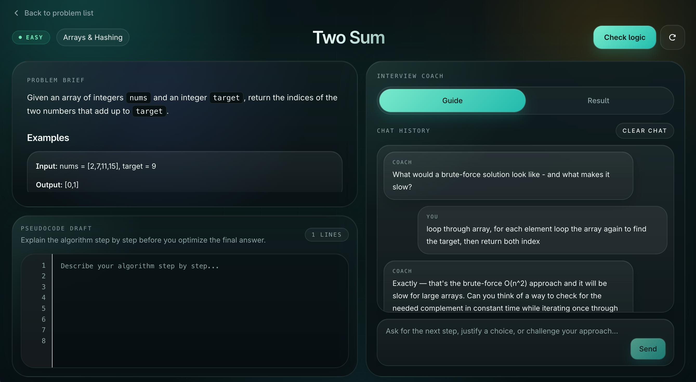
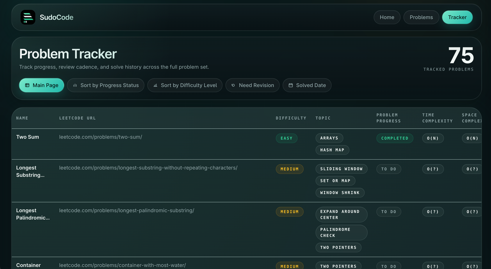

<p align="center">
  
</p>

# SudoCode

SudoCode is a logic-first interview practice app for solving data structures and algorithms problems in pseudocode. Instead of compiling code, it focuses on reasoning: draft an approach, get structured AI feedback, talk through the problem with a guide chatbot, and track your progress across the full set.

## Screenshots

Add these screenshot files to the project root so they render in this README:

- `readme-problem-workspace.png`
- `readme-tracker.png`

<p align="center">
  
  
</p>

## What the app does

- Practice against a seeded set of **75 interview-style problems**
- Solve problems in a dedicated pseudocode workspace
- Get a structured AI review with verdict, summary, issues, and complexity
- Use the guide chatbot for a more interactive, interviewer-style coaching flow
- Keep local progress in a tracker with completion state, review cadence, notes, and solve dates
- Persist drafts and tracker state locally so work is not lost between refreshes

## Core flows

### Problem workspace

- Read the prompt, examples, and constraints
- Write pseudocode in the editor
- Run `Check logic` for structured review
- Switch to `Guide` mode to talk through the problem with the AI coach

### Tracker

- See what you have completed out of the full set
- Track which problems are in progress or need review
- Store time spent, language, notes, companies, and review frequency

## Tech stack

- Next.js App Router
- React 19
- TypeScript
- Tailwind CSS
- OpenAI API
- Zod
- Local seed data + localStorage persistence

## Getting started

1. Install dependencies:

```bash
npm install
```

2. Create your local env file:

```bash
cp .env.example .env.local
```

3. Add your OpenAI API key to `.env.local`:

```bash
OPENAI_API_KEY=your_key_here
```

4. Start the app:

```bash
npm run dev
```

5. Open `http://localhost:3000`

## Environment variables

- `OPENAI_API_KEY`: required for review and guide responses
- `OPENAI_MODEL`: optional, defaults to `gpt-5-mini`

## Available scripts

- `npm run dev`: start the development server
- `npm run build`: build for production
- `npm run start`: run the production build
- `npm run lint`: run ESLint
- `npm run typecheck`: run TypeScript checks

## Project structure

```text
app/
  api/review/route.ts          Standard structured review endpoint
  api/review/guide/route.ts    Guide chatbot endpoint
  problems/[slug]/page.tsx     Problem workspace route
  tracker/page.tsx             Tracker route
components/
  feedback-panel.tsx           Review + guide panel UI
  problem-catalog.tsx          Problem queue page
  problem-pane.tsx             Problem brief panel
  problem-tracker.tsx          Tracker interface
  problem-workspace.tsx        Main problem-solving experience
data/
  problems.ts                  Seeded problem bank
  tracker-metadata.ts          Tracker metadata per problem
lib/
  problems.ts                  Problem lookup helpers
  review-schema.ts             Shared review and guide schemas
  tracker.ts                   Tracker state helpers
types/
  problem.ts                   Problem types
  tracker.ts                   Tracker types
```

## Notes

- The app is intentionally focused on interview reasoning, not code execution
- Problem content is seeded locally for speed and simple deployment
- Tracker data and editor drafts are stored client-side
- The review and guide flows are designed to feel like interview feedback, not compiler output
